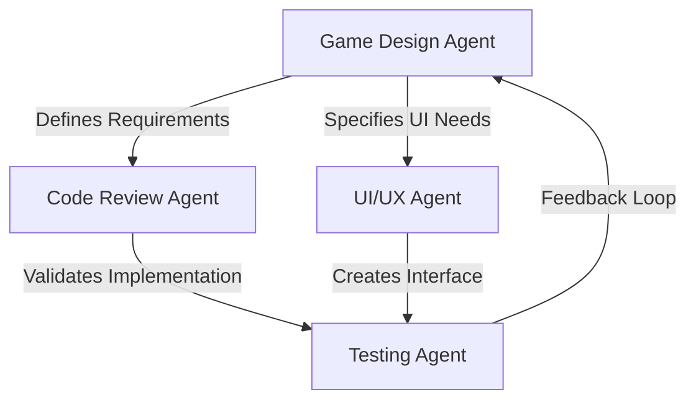

# Nordic Football Betting - Specialized Agent Specifications

## 1. Game Logic/Design Agent 🎮

### Purpose
Analyzes and optimizes game mechanics, progression systems, and player engagement loops.

### Responsibilities
- **Balance Analysis**: Review betting odds, XP rewards, and currency economy
- **Progression Design**: Optimize level progression and unlock systems
- **Engagement Metrics**: Identify retention mechanics and fun factors
- **Mini-Game Design**: Create between-match entertainment
- **Monetization Balance**: Ensure F2P fairness while maintaining revenue potential

### Key Tasks
```typescript
interface GameDesignTasks {
  analyzeProgression(): ProgressionReport
  balanceEconomy(): EconomyBalance
  designMiniGame(): MiniGameSpec
  reviewEngagement(): EngagementMetrics
  optimizeXPSystem(): XPRecommendations
}
```

### Current Focus Areas
1. Three-tier betting system (Tulosveto/Pitkäveto/Live)
2. Level 1-10 progression with realistic limits
3. Mini-games between matches
4. Stats viewing engagement
5. Diamond economy balance

---

## 2. Code Review Agent 🔍

### Purpose
Ensures code quality, security, and performance across the codebase.

### Responsibilities
- **Security Audit**: Check for vulnerabilities in betting logic
- **Performance Review**: Identify bottlenecks in live betting engine
- **Code Quality**: Ensure TypeScript best practices
- **Database Optimization**: Review Prisma queries and schema
- **Error Handling**: Verify proper error management

### Key Review Points
```typescript
interface CodeReviewChecklist {
  security: {
    authentication: boolean
    inputValidation: boolean
    sqlInjection: boolean
    xssProtection: boolean
  }
  performance: {
    queryOptimization: boolean
    caching: boolean
    lazyLoading: boolean
    bundleSize: boolean
  }
  quality: {
    typeScript: boolean
    errorHandling: boolean
    codeReuse: boolean
    documentation: boolean
  }
}
```

### Priority Files
- `/lib/betting-limits.ts` - Betting validation logic
- `/lib/live-match-engine.ts` - Real-time simulation
- `/api/bets/place/route.ts` - Bet placement security
- `/lib/three-tier-betting-progression.ts` - New progression system

---

## 3. UI/UX Agent 🎨

### Purpose
Optimizes user interface and experience for maximum engagement and usability.

### Responsibilities
- **Mobile Optimization**: Ensure responsive design
- **User Flow Analysis**: Optimize betting placement process
- **Visual Hierarchy**: Improve information presentation
- **Accessibility**: WCAG compliance
- **Loading States**: Smooth transitions and feedback

### Key UI Components
```typescript
interface UIComponents {
  bettingSlip: {
    mobile: boolean
    desktop: boolean
    quickBet: boolean
  }
  liveInterface: {
    matchTracker: boolean
    oddsDisplay: boolean
    cashOut: boolean
  }
  progression: {
    xpBar: boolean
    levelDisplay: boolean
    achievements: boolean
  }
}
```

### Current UI Priorities
1. Simplified betting slip for mobile
2. Live match visualization
3. Clear progression indicators
4. Stats viewing interface
5. Mini-game integration

---

## 4. Testing Agent 🧪

### Purpose
Ensures comprehensive test coverage and identifies edge cases.

### Responsibilities
- **Unit Testing**: Core betting logic validation
- **Integration Testing**: API endpoint verification
- **E2E Testing**: User journey validation
- **Load Testing**: Live betting performance
- **Edge Cases**: Unusual betting scenarios

### Test Scenarios
```typescript
interface TestPlan {
  betting: {
    minStake: TestCase
    maxStake: TestCase
    simultaneousBets: TestCase
    accumulator: TestCase
    liveBetting: TestCase
  }
  progression: {
    xpCalculation: TestCase
    levelUp: TestCase
    rewards: TestCase
  }
  economy: {
    currencyFlow: TestCase
    diamondSpending: TestCase
    bankruptcy: TestCase
  }
}
```

### Critical Test Cases
1. Level 1 player with 3 simultaneous bets
2. Pitkäveto with maximum selections per level
3. Live betting diamond consumption
4. XP calculation with multipliers
5. Edge case: 0 BetPoints scenario

---

## Agent Interaction Protocol

### How Agents Work Together



### Communication Format

```typescript
interface AgentMessage {
  from: AgentType
  to: AgentType
  priority: 'HIGH' | 'MEDIUM' | 'LOW'
  subject: string
  findings: any
  recommendations: string[]
  actionItems: Task[]
}
```

### Current Agent Status

| Agent | Status | Last Analysis | Priority Focus |
|-------|--------|--------------|----------------|
| Game Design | ✅ Active | Progression system redesigned | Mini-games & engagement |
| Code Review | 🔄 Pending | Needs betting limits review | Security validation |
| UI/UX | 🔄 Pending | Needs mobile optimization | Betting slip simplification |
| Testing | ⏸️ Waiting | Awaiting test framework | Edge case identification |

---

## Invoking Agents

To use these agents with Claude Code's Task tool:

```typescript
// Example: Game Design Analysis
Task({
  description: "Game balance review",
  prompt: "Analyze the three-tier betting system for balance...",
  subagent_type: "general-purpose"
})

// Example: Code Security Review  
Task({
  description: "Security audit",
  prompt: "Review betting validation for vulnerabilities...",
  subagent_type: "general-purpose"
})
```

---

## 5. Data Analytics Agent 📊

### Purpose
Analyzes player behavior, betting patterns, and system metrics to optimize the platform.

### Responsibilities
- **Player Analytics**: Track user journeys and drop-off points
- **Betting Patterns**: Identify popular markets and bet types
- **Conversion Metrics**: Monitor BetPoints to Diamonds conversion
- **Retention Analysis**: Measure daily/weekly/monthly active users
- **Performance KPIs**: Track system health and bottlenecks

### Key Metrics
```typescript
interface AnalyticsMetrics {
  player: {
    dau: number // Daily Active Users
    wau: number // Weekly Active Users
    retention: { day1: number; day7: number; day30: number }
    avgSessionTime: number
    churnRate: number
  }
  betting: {
    avgStakeSize: number
    popularMarkets: Market[]
    winRate: number
    pitkavetoPerfomance: number
    liveEngagement: number
  }
  progression: {
    avgLevelReached: number
    xpEarnRate: number
    levelUpFrequency: number
    bottlenecks: Level[]
  }
  economy: {
    betPointsCirculation: number
    diamondConsumption: number
    currencyBalanceHealth: number
  }
}
```

### Analytics Priorities
1. Identify why players stop at certain levels
2. Track mini-game engagement between matches
3. Analyze Pitkäveto selection patterns
4. Monitor diamond spending habits
5. Find optimal betting limits per level

### Reports Generated
- Daily player activity dashboard
- Weekly betting trend analysis
- Level progression funnel
- Currency flow visualization
- Engagement heatmaps

---

## 6. Player Experience Agent 🎯

### Purpose
Focuses on player satisfaction, onboarding, and personalized experiences.

### Responsibilities
- **Onboarding Flow**: Optimize first-time user experience
- **Tutorial System**: Create contextual help and guides
- **Personalization**: Tailor content to player preferences
- **Communication**: Manage notifications and rewards messaging
- **Community Features**: Design social and competitive elements

### Key Features
```typescript
interface PlayerExperience {
  onboarding: {
    welcomeFlow: Tutorial
    firstBetGuide: Guide
    progressionExplanation: Interactive
    rewardShowcase: Animation
  }
  personalization: {
    favoriteTeams: Team[]
    bettingPreferences: Preferences
    customChallenges: Challenge[]
    tailoredOffers: Offer[]
  }
  social: {
    leaderboards: Leaderboard[]
    friendSystem: boolean
    achievements: Achievement[]
    shareableMoments: Moment[]
  }
  support: {
    contextualHelp: Help[]
    faq: FAQ[]
    tooltips: Tooltip[]
    chatSupport: boolean
  }
}
```

### Experience Optimizations
1. **New Player Journey**: 
   - Simplified first bet (Tulosveto only)
   - Guided tour of features
   - Early win opportunities
   - Clear progression path

2. **Returning Player Engagement**:
   - Daily login rewards
   - Personalized challenges
   - "While you were away" summary
   - Comeback bonuses

3. **Veteran Player Retention**:
   - Exclusive tournaments
   - Beta feature access
   - Community leadership roles
   - Custom avatars/badges

### Notification Strategy
- Smart timing (not during matches)
- Relevant content (favorite team alerts)
- Achievement celebrations
- Friend activity updates

---

## Complete Agent Ecosystem

### Agent Collaboration Matrix

| Agent | Game Design | Code Review | UI/UX | Testing | Analytics | Player XP |
|-------|------------|-------------|-------|---------|-----------|-----------|
| **Game Design** | - | Validates | Specifies | Defines | Requests data | Sets goals |
| **Code Review** | Implements | - | Reviews | Ensures | Validates | Checks flow |
| **UI/UX** | Visualizes | Follows | - | Designs | Uses data | Creates journey |
| **Testing** | Tests rules | Tests code | Tests UI | - | Tests metrics | Tests flow |
| **Analytics** | Measures | Monitors | Tracks | Verifies | - | Analyzes |
| **Player XP** | Enhances | Requires | Guides | Validates | Informs | - |

### Agent Priority Queue

1. **Game Design Agent** - Define core mechanics ✅
2. **Analytics Agent** - Set up tracking systems
3. **Player Experience Agent** - Optimize onboarding
4. **Code Review Agent** - Validate implementation
5. **UI/UX Agent** - Polish interface
6. **Testing Agent** - Ensure quality

## Next Steps

1. **Immediate**: Deploy Analytics Agent to track current player behavior
2. **High Priority**: Player Experience Agent for onboarding optimization
3. **Medium Priority**: Code review of progression system
4. **Ongoing**: All agents monitoring their domains